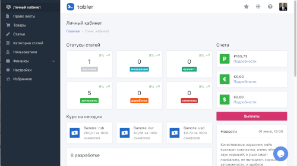
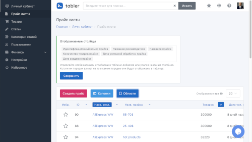
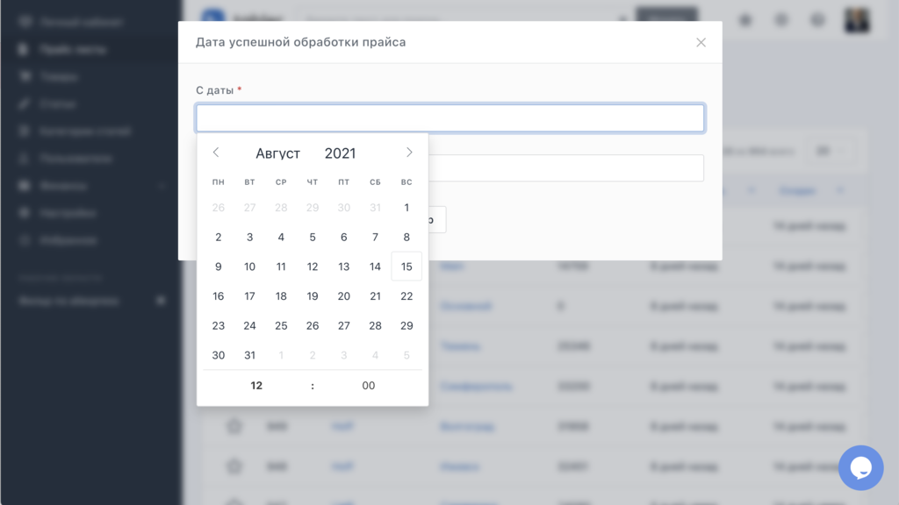
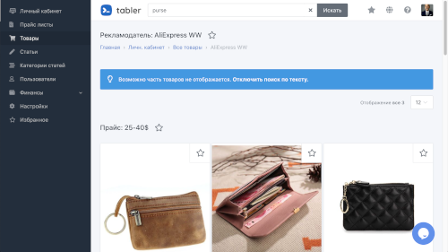
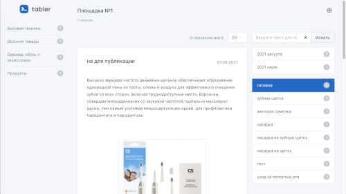
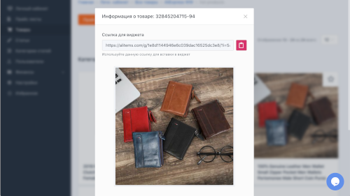
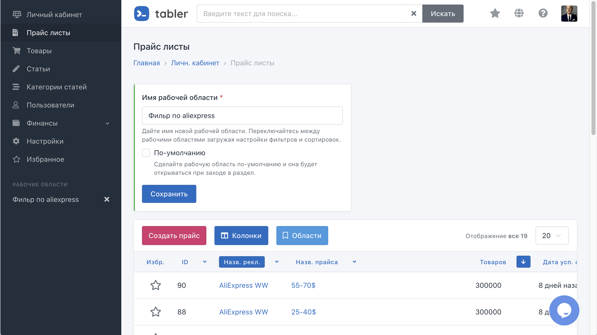

# [goodreviews.ru](https://goodreviews.ru)

### Setup

```shell
docker-compose up -d
./bin/setup
./bin/webpack-dev-server
./bin/rails s
```

The following addresses available after project start up:

- Rails application: http://localhost:3000
- Mailcatcher http://localhost:1080
- Kibana http://localhost:5601


Sign in using `admin@example.com` / `password`

If things works right then you could seed some test data for development purposes:

```
rake hub:tests:seed
```

That's it. More docs available at [docs](/docs).

### Screenshots

Dashboard page  



Feeds page  
  

Filter results  


Offers page  


Profile edit  


Realm  


Widget  


Widget modal  


Workspaces  


Writing article  

