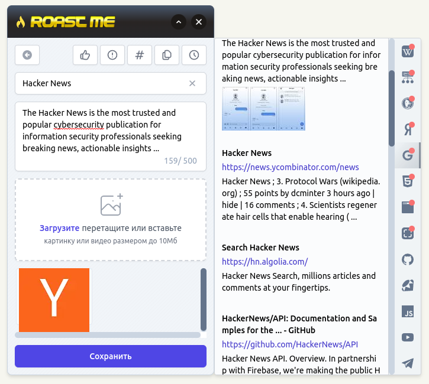

# goodreviews.ru

```shell
docker-compose up -d
./bin/setup
./bin/webpack-dev-server
./bin/rails s
```

The following addresses available after project start up:

- Rails application: http://localhost:3000
- Mailcatcher http://localhost:1080
- Kibana http://localhost:5601

Sign in using `admin@example.com` / `password`

If things works right then you could seed some test data for development purposes:

```
rake hub:tests:seed
```

That's it. More docs available at `/docs`


Dashboard page


Feeds page


Filter results


Offers page


Profile edit


Realm


Widget


Widget modal


Workspaces


Writing article