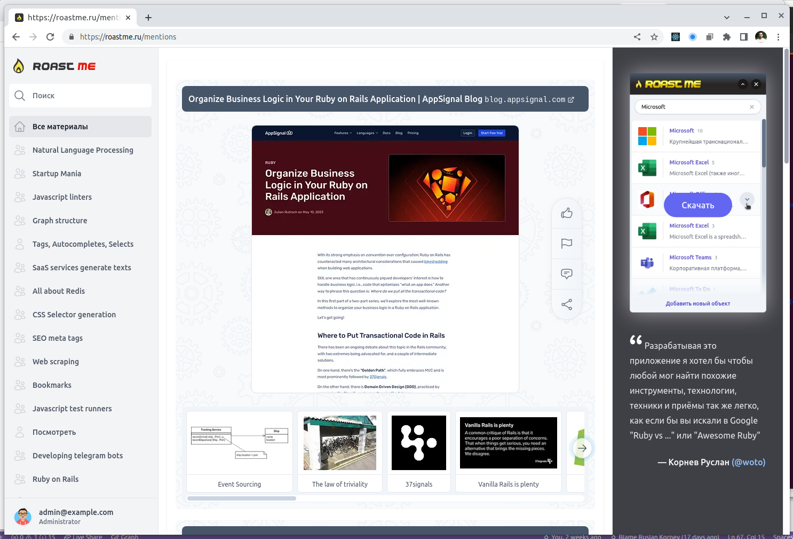

# [roastme.ru](https://roastme.ru)

"Roastme" project aim to unite developers willing to create. It is list of manually picked news about programming, AI, contries legislations, digital nomands, SaaS instruments, github repositories... with precise enumeration of entities mentioned in this news for faster understanding does this news deserve attention or must be roasted. It helps to discover new things just before you think of.

## CircleCI Tests

[](https://dl.circleci.com/status-badge/redirect/gh/woto/hub/tree/master)

## Github Actions Tests

[](https://github.com/woto/hub/actions)

# Setup

```shell
git clone https://github.com/woto/hub --recurse-submodules
cd hub
docker compose up -d
./bin/setup
yarn install
gem install foreman
foreman start -f ./Procfile.dev
# Run in separate processes rails and sidekiq
sidekiq: bundle exec sidekiq
rails: bin/rails server -p 3000 -b 0.0.0.0
# You may uncomment this lines in Procfile.dev
```

The following addresses available after project start up:

- Rails application: http://localhost:3000
- Elasticsearch used for storing and search. All data could be erased and reindexed from Postgres.
- Iframely used for getting metainformation about interested webpage: microdata, rdfa, microformat, json-ld...
- Imgproxy used for proxying images. To be more specific for displaying image on the same host to pass CORS while uploading images with "drag and drop" or "copy paste".
- Kibana used as UI for Elasticsearch. http://localhost:5601
- Mailcatcher used as a mock service for emails sent from website. http://localhost:1080
- Mosquitto used for experiments with MQTT.
- Postgresql used as a main database.
- Redis used for rails caching, storing some identifiers in telegram bot, etc...
- Scrapper is a custom Node.js script used for making screenshots.
- Telegram bot used for receiving citations from as a rule mobile devices. In another words where Chrome extension could not be installed.
- Traefik used only in production environment primaraly for SSL certificates convenience.

Some services run in development mode as a separated processes, but in production all services run in Docker containers.
You may check differences in development and production files respectivly: docker-compose.yml, docker-compose.production

Also check https://github.com/woto/extension for Chrome extension which is used as the only one instrument to add citations to website.

You also may want to view Procfile.dev and modify them as you wish. For example you may want to comment rails and run it separatly if you want for example to debug interactively.


Sign in using `admin@example.com` / `password`

If things work right then you could seed some test data for development purposes:

```
rake hub:tests:seed
```

That's it. More docs available at [docs](/docs).

# Tests

```shell
bundle exec rspec
```

# Hub
https://github.com/woto/hub

## Mentions list


## Entity popup


## Entity page


## Related entities


# Google chrome Extenstion
https://github.com/woto/extension

## Context menu


## Wikipedia


## Google Graph


## Duck Duck Go


## Yandex


## Google


## RDFa, Microdata, JSON-LD


## Scrape


## Screenshot


## Github


## Rubygems


## NPM


## Youtube


## Telegram


## Raw metadata


## Sentiment


## Synonyms


## Tags


## Publication date


## Priority

