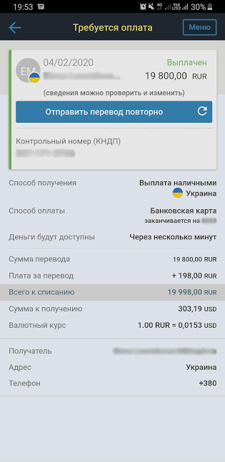

Ok, I'm glad to inform that I've made first payment into Ukraine with payment system Western Union. It were quiet easy.
Maybe my concerns were overblown. Anyway here is results:

As you can see official Russian Central Bank rate on that day were:  
1 USA Dollar = 63.9091 Russian Rubles  
[Link to proof](https://www.cbr.ru/currency_base/dynamics/?UniDbQuery.Posted=True&UniDbQuery.mode=1&UniDbQuery.date_req1=&UniDbQuery.date_req2=&UniDbQuery.VAL_NM_RQ=R01235&UniDbQuery.FromDate=04.02.2020&UniDbQuery.ToDate=04.02.2020)

And as you can see rate in application were:  
1 USA Dollar = 65.305 Russian Rubles (not so good)  

Plus 198 Rubles commission for remittance.
